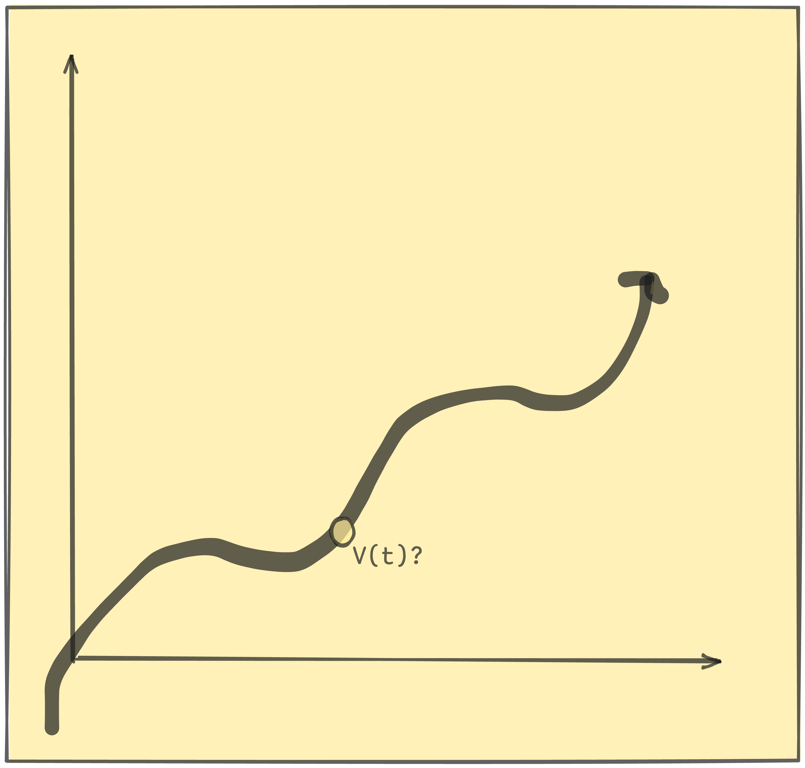

# Motion in a Straight Line

**Overview**

Straight Line === 1D Motion \
*But there's other ways that you can have 1D motion, such as with an orbiting spaceship (it can only go in a circle)

**Variables Associated with 1D Motion**

|Association|Symbol|
|----|-----|
|Position|usually x|
|Displacement|$\Delta$|
|Distance|total path traveled: $\int_{x_o}^{x_e} dx$|

**Graphicing Position**

*Average Velocity*

$\hat{v} = {{\Delta x} \over {\Delta t}} = \frac{x_2 - x_1}{t_2 t_1}$ (i.e slope of secant line; distance traveled / time traveled)

*Average Speed*

$\hat{s} = \int {{\delta x} \over {\Delta t}}$

*Instantaneous Velocity*

(Look at V(t))

